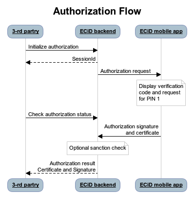
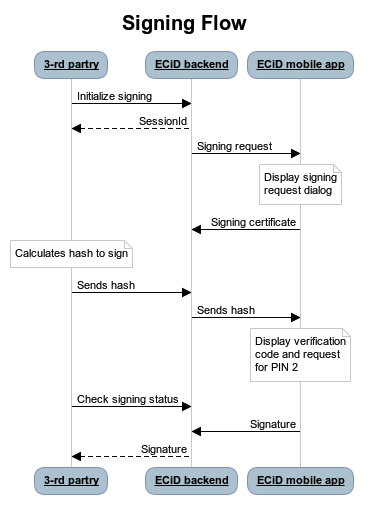

# Table of Contents

* [1. Introduction](#1-introduction)
    * [1.1. Terminology](#11-terminology)
* [2. References](#2-references)
* [3. General description](#3-general-description)
    * [3.1. Third Party registration](#31-third-party-registration)
    * [3.2. Hash algorithms](#32-hash-algorithms)
    * [3.3. API endpoint secure connection](#33-api-endpoint-secure-connection)
    * [3.4. API authentication](#34-api-authentication)
    * [3.5. Delay API call until user has seen verification code](#35-delay-api-call-until-user-has-seen-verification-code)
* [4. REST API](#4-rest-api)
    * [4.1. Interface patterns](#41-interface-patterns)
        * [4.1.1. Session management](#411-session-management)
        * [4.1.2. HTTP status code usage](#412-http-status-code-usage)
    * [4.2. REST API authorization flow](#42-rest-api-authorization-flow)
    * [4.3. Authorization session init](#43-authorization-session-init)
        * [4.3.1. Preconditions](#431-preconditions)
        * [4.3.2. Authorization request parameters](#432-authorization-request-parameters)
        * [4.3.3. Example responses](#433-example-responses)
    * [4.4. Session status](#44-session-status)
        * [4.4.1. Preconditions](#441-preconditions)
        * [4.4.2. Response structure](#442-response-structure)
    * [4.5. Cancel authentication](#45-cancel-authentication)
        * [4.5.1. Preconditions](#451-preconditions)
        * [4.5.2. Example response](#452-example-response)
    * [4.6. REST API signing flow](#46-rest-api-signing-flow)
    * [4.7. Signing session init](#47-signing-session-init)
        * [4.7.1. Preconditions](#471-preconditions)
        * [4.7.2. Signing init request parameters](#472-signing-init-request-parameters)
        * [4.7.3. Example responses](#473-example-responses)
    * [4.8. Session hash](#48-session-hash)
        * [4.8.1. Preconditions](#481-preconditions)
        * [4.8.2. Session hash request parameters](#482-session-hash-request-parameters)
        * [4.4.3. Response structure](#483-response-structure)
    * [4.9. Cancel signing](#49-cancel-signing)
        * [4.9.1. Preconditions](#491-preconditions)
        * [4.9.2. Example response](#492-example-response)
* [5. GRPC API](#5-grpc-api)
    * [5.1. Protocol buffer files](#51-protocol-buffer-files)
    * [5.2. Sample project](#52-sample-project)
* [6. Session end result codes](#6-session-end-result-codes)
* [7. Protocols](#7-protocols)
    * [7.1. Session protocol](#71-session-protocol)
        * [7.1.1. Sending session request](#711-sending-session-request)
        * [7.1.2. Computing the verification code](#712-computing-the-verification-code)
        * [7.1.3. Verifying the session response](#713-verifying-the-session-response)

# 1. Introduction

Third party interface offers the entry point to ECiD main use cases, i.e. authentication and signing.

The interface is to be used by all parties who wish consume ECiD services, i.e. ask end users to perform authorization and/or signing requests.

## 1.1. Terminology

* **Third party** - Some kind of internet service (like an internet banking site or a website that requires strong user verification).
* **Session** - A process initiated by Third party, which contains a single certificate choice and authorization or signing operation.
* **Email** - Registered user email address used as main identification parameter

# 2. References

* X.509 certificate https://en.wikipedia.org/wiki/X.509 
* ECDSA Signature https://en.wikipedia.org/wiki/Elliptic_Curve_Digital_Signature_Algorithm
* OCSP https://en.wikipedia.org/wiki/Online_Certificate_Status_Protocol

# 3. General description

ECiDentity API is exposed over a REST & GRPC interface as described below.

REST payloads are encoded using UTF-8. All requests support HTTP/1.1 only.
GRPC requests support HTTP/2.0 only.

## 3.1. Third Party registration

To be able to use ECiDentity API, you must register your company at https://customer.ecidentity.io and sandbox is https://demo-customer.ecidentity.io.

## 3.2. Hash algorithms

ECiD supports hash operations based on SHA-256. Their corresponding identifiers in APIs are "SHA256".

## 3.3. API endpoint secure connection

It is important that Third Party performs all the required checks when connecting to the API, to make sure that the connection is secure. This is required to prevent MITM attacks.

The Third Party must do the following checks:

1. Verify if the HTTPS connection and the TLS handshake is performed with the secure TLS client.
1. Verify that the X.509 certificate of the HTTPS endpoint is valid (not expired, signed by trusted CA and not revoked)

## 3.4. API authentication

To be able to use ECiDentity REST API, you must pass next http headers: your access key id as X-EC-Key and payload signature as X-EC-Signature.
GRPC API request payloads must be supplied with access key id and have signature.

Access key id can be obtained in private cabinet after company registration.

## 3.5. Delay API call until user has seen verification code

When ECiD is used to perform a transaction on the same device it is installed on (browser or Third Party app) the push notification can arrive quickly and bring the ECiD app into the foreground before the user has had a chance to read the verification code presented by the third Party.

To give the user time to read the verification code the Third Party should delay the RP API call a few moments.

# 4. REST API

## 4.1. Interface patterns

The BASE_URL for ECiDentity production environment is https://api.ecidentity.io/ and sandbox is https://demo-api.ecidentity.io/

### 4.1.1. Session management

Base of all operations on the API is a "session".

Session is created using POST requests and it ends when a result gets created or when session ends with an error.

Session is identified by an id, in reality a long random hexadecimal string.

Session result can be obtained using a request described below.

Session can be canceled as well.

### 4.1.2. HTTP status code usage

Normally, all responses are given using HTTP status code "200 OK".

In some cases, HTTP 4xx series error codes are used:

* HTTP error code 400 - Insufficient or invalid request parameters.
* HTTP error code 404 - object described in URL was not found in ECiDentity API.

All 5xx series error codes indicate some kind of fatal server error.

## 4.2. REST API authorization flow



## 4.3. Authorization session init

Method | URL
-------|----
POST | BASE_URL/auth/init

This method is the main entry point to authorization logic.

### 4.3.1. Preconditions

* User whose email address identified in the request is present in the system.
* User has certificate with level which is equal to than the level requested.

### 4.3.2. Authorization request parameters

Parameter | Type | Mandatory | Description
----------|------|-----------|------------
email | string | + | Email of user to be authenticated.
type | string | + | Level of certificate requested. "EMAIL" or "PERSONAL".
hashToSign | string | + | SHA-256 random hash as hex encoded string.
withReport | boolean |  | Used to request document verification report in pdf format. Default value is "false" to reduce request time.
withSanctions | boolean |  | Used to search person in sanction list. Default value is "false" to reduce request time. Sanction check will be performed only when personal certificate requested. Default value is "false" to reduce request time.
extractSubject | boolean |  | Used to add show details from certificate subject data. Default value is "false" to reduce request time.

**Init authorization request:**
```
{
	"email": "some@mail.com",
	"hashToSign": "5AD9BC84FD576...EF82",
	"type": "PERSONAL",
	"withReport": true,
	"withSanctions": true,
	"extractSubject": false
}
```

### 4.3.3. Example responses

This response is returned from POST method call that create a new session.

**Successful authorization session creation response that contains session id and expiration time in UTC timestamp format:**
```
{
  "sessionId": "2875F298A8D1...32A8",
  "expiresAt": 1579474548173,
  "resultCode": "OK"
}
```

**Unsuccessful response**
```
{
  "resultCode": "NOT_REGISTERED"
}
```

## 4.4. Session status

Method | URL
-------|----
POST | BASE_URL/auth/check

```
{
  "sessionId": "2875F298A8D1...32A8"
}
```

This method used to retrieve session result from ECiDentity backend.

This is a long poll method, meaning it might take about three seconds and request should be repeated if session not completed, expired or canceled.

### 4.4.1. Preconditions

* Session is present in the system and the request is either started less than 3 minutes ago.

### 4.4.2. Response structure

Parameter | Type | Mandatory | Description
----------|------|-----------|------------
resultCode | string | + | Result of request.
certificate | string | + | Certificate value as hex encoded string. The certificate itself contains user info corresponding to requested type.
signedHash | string | + | ECDSA signature value, as hex encoded string. Signature algorithm is sha256WithDSA.
report | string |  | Document verification report in Base64 encoded pdf file.
subject | map |  | Map of values extracted from certificate subject.
sanctions | array |  | List of sanction databases that contains info about certificate owner.

**Successful response after completion:**
```
{
    "resultCode": "OK",
    "certificate": "HEXADECIMAL STRING",
    "signedHash": "HEXADECIMAL STRING",
    "report": "BASE64 ENCODED PDF",
	"subject": {
            "firstName": "Jhon",
            "lastName": "Smith",
            "...", "..."
    },
    "sanctions": {
        "EU...",
        "AML..."
    }
}
```

## 4.5 Cancel authentication

Method | URL
-------|----
POST | BASE/auth/cancel

```
{
  "sessionId": "2875F298A8D1...32A8"
}
```

This method can be used to cancel session.

### 4.5.1. Preconditions

* Session is present in the system and the request is started less than 180 seconds ago.

### 4.5.2. Example response

This response is returned from GET method call that cancel session.

**Successful response**
```
{
  "resultCode": "OK"
}
```

## 4.6. REST API signing flow



## 4.7. Signing session init

Method | URL
-------|----
POST | BASE_URL/sign/init

This method is the main entry point to signing logic.
This is a long poll method, meaning it might not return until a timeout(180 seconds) expires or user confirms or rejects signing request.

### 4.7.1. Preconditions

* User whose Email identified in the request is present in the system.
* User has certificate with level which is equal to than the level requested.

### 4.7.2. Signing init request parameters

Parameter | Type | Mandatory | Description
----------|------|-----------|------------
email | string | + | Email of user to be authenticated.
type | string | + | Level of certificate requested. "EMAIL" or "PERSONAL".

**Init signing request:**
```
{
	"email": "some@gmail.com",
	"type": "PERSONAL"
}
```

### 4.7.3. Example responses

This response is returned from POST method call that create a new session.

**Successful signing session creation response that contains session id and expiration time in UTC timestamp format:**
```
{
  "sessionId": "2875F298A8D1...32A8",
  "certificate": "HEXADECIMAL STRING",
  "expiresAt": 1579474548173,
  "resultCode": "OK"
}
```

**Unsuccessful response**
```
{
  "resultCode": "NOT_REGISTERED"
}
```

## 4.8. Session hash

Method | URL
-------|----
POST | BASE_URL/sign/hash

This method  used to update session with hash to sign value.
This is a long poll method, meaning it might not return until a timeout(180 seconds) expires or user confirms or rejects signing request.

### 4.8.1. Preconditions

* Session is present in the system and the request is started less than 3 minutes ago.

### 4.8.2. Session hash request parameters

Parameter | Type | Mandatory | Description
----------|------|-----------|------------
sessionId | string | + | Session id received from init session request.
hashToSign | string | + | SHA-256 random hash as hex encoded string.

**Update session hash request:**
```
{
	"sessionId": "2875F298A8D1...32A8",
	"hashToSign": "5AD9BC84FD576...EF82"
}
```

### 4.8.3. Response structure

Parameter | Type | Mandatory | Description
----------|------|-----------|------------
resultCode | string | + | Result of request.
certificate | string | + | Certificate value as hex encoded string. The certificate itself contains user info corresponding to requested type.
signedHash | string | + | ECDSA signature value, as hex encoded string. Signature algorithm is sha256WithDSA.
report | string |  | Document verification report in Base64 encoded pdf file.
subject | map |  | Map of values extracted from certificate subject.
sanctions | array |  | List of sanction databases that contains info about certificate owner.

**Successful response after completion:**
```
{
    "resultCode": "OK",
    "signedHash": ""
}
```

## 4.9 Cancel signing

Method | URL
-------|----
GET | BASE/sign/cancel

This method can be used to cancel session.

### 4.9.1. Preconditions

* Session is present in the system and the request is either running or has been completed less than 3 minutes ago.

### 4.9.2. Example response

This response is returned from GET method call that cancel session.

**Successful response**
```
{
  "resultCode": "OK"
}
```

# 5. GRPC API

## 5.1 Protocol buffer files

Files for generating RPC services toy can find [here](proto/).

## 5.2 Sample project

[Sample project in kotlin](https://github.com/ecidentity/integration-grpc-kotlin).

# 6. Session end result codes

* **OK** - request was completed successfully, with most positive scenario.
* **PENDING** - waiting for user's response.
* **REFUSED** - user refused the session.
* **TIMEOUT** - there was a timeout, i.e. end user did not confirm or refuse the operation within given timeframe.
* **UNUSABLE** - for some reason, this third party request cannot be completed.
* **WRONG_VC** - in case the three-choice verification code was requested, the user did not choose the correct verification code.
* **REVOKED** - user's certificate is revoked.
* **INVALID_SIGNATURE** - user sends invalid signature.
* **NOT_REGISTERED** - email address not present in the system.
* **NO_CERTIFICATE** - user does not have a certificate of the requested level.
* **SECURITY_EXCEPTION** - request has invalid signature.
* **BLOCKED** - access key is not present in the system or revoked.
* **NOT_FOUND** - requested session not found.

# 7. Protocols

Previous sections give the overview of the specific API methods, which can be used to perform the authorization and signing operation. This section gives the overview of how to securely combine them and how to deduce the operation result.

## 7.1. Session protocol

### 7.1.1. Sending session request

The third party must create the new hash value for each new authorization request. The recommended way of doing this is to use the secure random algorithm or equivalent method, to generated random value for each new authorization request.

For example, the following code snippet generates the 64 random bytes and computes the hash value and encodes it in Base64.

The value of the 'hashToSign' for authorization must be recorded in the current user's session for later comparison.

### 7.1.2. Computing the verification code

The RP must then compute the verification code for this Authorization request, so that user can bind together the session on the browser and the Authorization request on the ECiD app. The VC is computed as

```
integer(SHA256(hash)[−2:−1]) mod 10000
```

where we take SHA256 result, extract 2 rightmost bytes from it, interpret them as a big-endian unsigned integer and take the last 4 digits in decimal for display. SHA256 is always used here, no matter what was the algorithm used to calculate hash.

Please mind that hash is real hash byte value (for example, the byte array returned from the md.digest() call), not Base64 form used for transport.

The VC value must be displayed to the user in the browser together with a message that ask the end user to verify the code.

### 7.1.3. Verifying the session response

After receiving the session response from the API call, the following algorithm must be used to decide, if the operation result is trustworthy.

* "signature" value in GRPC or "X-EC-Signature" header value in REST response is the valid signature, verifiable with the public key inside the server certificate.
* "resultCode" has the value "OK"
* "signedHash" is the valid signature, verifiable with the public key inside the certificate of the user, given in the field "certificate"
* The person's certificate given in the "certificate" is valid (not expired, signed by trusted CA and with correct (i.e. the same as in response structure, greater than or equal to that in the original request) level).
* The identity of the authenticated person is in the 'subject' field of the included X.509 certificate.

After successful authorization or signing session, the RP must invalidate the old user's browser or API session identifier and generate a new one.
